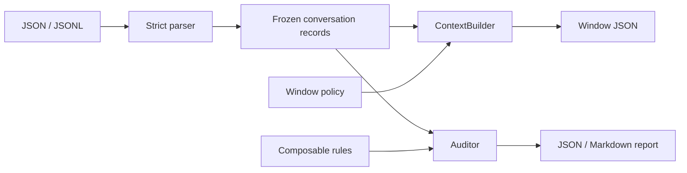

# TurnScope

TurnScope builds deterministic context windows from conversation datasets and audits the assumptions that make those
windows trustworthy. It is designed for dataset preparation, evaluation pipelines, prompt assembly, and debugging
chat or threaded-discussion exports.

[](https://github.com/appleweiping/turnscope/actions/workflows/ci.yml)
[](https://github.com/appleweiping/turnscope/actions/workflows/codeql.yml)
[](https://scorecard.dev/viewer/?uri=github.com/appleweiping/turnscope)
[](https://github.com/appleweiping/turnscope/releases)
[](https://www.python.org/)
[](LICENSE)

Conversation records often look valid while quietly containing duplicate identifiers, out-of-order timestamps,
replies to missing or future turns, accidental same-role runs, or inconsistent token counts. If context is built first,
those defects become data leakage or irreproducible evaluation results. TurnScope keeps construction and validation
separate, explicit, and dependency-free at runtime.

## Features

- Lazy, strict JSONL parsing with paths, physical line numbers, and duplicate-key checks.
- Located adapters for OpenAI, Anthropic, and ShareGPT chat records.
- Frozen core dataclass fields with copied, intentionally mutable metadata mappings.
- Turn-count, token-budget, elapsed-time, and reply-chain window policies.
- Output-sensitive built-in policy implementations for long conversations.
- Composable rules for chronology, IDs, reply integrity, role transitions, future leakage, and token accounting.
- Stable JSON for automation and compact Markdown for review.
- A typed streaming Python API, two deterministic token counters, and `turnscope build` / `turnscope audit` commands.
- Deterministic behavior: input order is preserved, ties are not silently reordered, and whole messages are selected.



## Installation

TurnScope requires Python 3.10 or newer.

```bash
python -m pip install "git+https://github.com/appleweiping/turnscope.git"
```

For an editable source checkout:

```bash
python -m pip install -e .
```

For development checks:

```bash
python -m pip install -e ".[dev]"
pytest
ruff check .
mypy src
```

## Quick start

The repository contains a complete example conversation:

```bash
turnscope audit examples/conversations.json --format markdown
```

Output begins:

```text
# TurnScope audit

Audited **1** conversations and **4** utterances.

Findings: **0** (0 errors, 0 warnings, 0 info).

No reliability issues found.
```

Build two-turn histories for every target:

```bash
turnscope build examples/conversations.json --policy turn --value 2 --output windows.json
```

Build only the reply ancestry for target `a2`:

```bash
turnscope build examples/conversations.json --policy reply-chain --target a2
```

The generated records include the full target, selected context, policy identity, and context token total:

```json
{
  "conversation_id": "support-001",
  "target": {"id": "a2", "role": "assistant", "text": "Try restarting it.", "timestamp": "2026-01-01T10:00:30Z", "reply_to": "u2", "token_count": 3},
  "context": [
    {"id": "u1", "role": "user", "text": "My app fails.", "timestamp": "2026-01-01T10:00:00Z", "token_count": 3},
    {"id": "a1", "role": "assistant", "text": "What error appears?", "timestamp": "2026-01-01T10:00:10Z", "reply_to": "u1", "token_count": 3},
    {"id": "u2", "role": "user", "text": "It still fails.", "timestamp": "2026-01-01T10:00:20Z", "reply_to": "a1", "token_count": 3}
  ],
  "policy": "reply-chain:all",
  "token_total": 9
}
```

## Python API

```python
from datetime import timedelta

from turnscope import ContextBuilder, TimeWindowPolicy, default_auditor
from turnscope.io import load_path

conversations = load_path("examples/conversations.json")
windows = ContextBuilder(TimeWindowPolicy(timedelta(minutes=5))).build(conversations[0])
report = default_auditor(token_budget=4096).audit(conversations)

for window in windows:
    print(window.target.id, window.utterance_ids)

if report.failing():
    print(report.counts())
```

Custom rules only need a stable `name` and `check(conversation) -> tuple[Issue, ...]`. Custom tokenizers can be passed
as any callable from text to a non-negative integer; supplied `token_count` values take precedence during windowing.

Stream a JSONL corpus and each conversation's windows without retaining either complete collection:

```python
from turnscope import ContextBuilder, TurnWindowPolicy, iter_path

builder = ContextBuilder(TurnWindowPolicy(8))
for conversation in iter_path("conversations.jsonl"):
    for window in builder.iter_build(conversation.id, conversation.utterances):
        consume(window)
```

Adapt a ShareGPT JSONL export with physical-line error locations:

```python
from turnscope import iter_adapted_path

for conversation in iter_adapted_path("sharegpt.jsonl", format="sharegpt"):
    consume(conversation)
```

`WhitespaceTokenCounter` preserves the default behavior. `Utf8ByteTokenCounter` offers a stable multilingual byte-based
estimate; neither pretends to match a model tokenizer. See the [Python API](docs/api.md),
[adapter contracts](docs/adapters.md), and [performance guide](docs/performance.md).

## CLI reference

### `turnscope build`

| Option | Meaning |
|---|---|
| `--policy turn` | Keep the latest N complete utterances; default N is 5. |
| `--policy token` | Keep the latest contiguous messages fitting N tokens; default is 512. |
| `--policy time` | Keep messages within N seconds of the target; default is 3600. |
| `--policy reply-chain` | Follow reply ancestors; omit `--value` for unlimited depth. |
| `--target ID` | Restrict output to a globally unique utterance ID; repeat for multiple targets. |
| `--output PATH` | Write UTF-8 JSON instead of standard output. |

### `turnscope audit`

`--format` selects Markdown or JSON. `--token-budget` adds a conversation-total rule. `--fail-on` controls the exit
threshold (`info`, `warning`, or `error`). Exit code 0 means no finding met the threshold, 1 means findings did, and 2
means the input or invocation could not be processed.

## Design guarantees

- Input sequence is authoritative. TurnScope reports chronology violations instead of sorting them away.
- Policies see only earlier positions, even when later timestamps would suggest otherwise.
- Token windows never truncate message text and stop at the first older message that cannot fit.
- Reply chains detect cycles and terminate deterministically.
- Unknown target IDs fail loudly rather than producing incomplete output.
- An output path that resolves to the input file is rejected before any data is written.
- Timestamps must carry an offset and are normalized to UTC.
- Serialization preserves Unicode and emits canonical UTC timestamps.

See [data format](docs/data-format.md) and [architecture](docs/architecture.md) for precise contracts.

## Limitations

- The default counter splits on whitespace; it is an estimate, not a model-specific tokenizer.
- Text-only adapters reject unsupported multimodal and tool-use content blocks rather than silently losing them.
- Adapter metadata names ignored vendor fields without copying their values; conflicting IDs, timestamps, or content
  semantics fail conversion.
- Role-transition rules cannot infer dataset-specific protocols. Configure or replace the rule when consecutive roles
  are intentional.
- Reply references are scoped to a single conversation.
- TurnScope audits and constructs windows; it does not redact sensitive data or run language models.

## Roadmap

- Config files for named policy and rule profiles.
- Optional integrations for exact model tokenizers and tabular exports.
- A documented plugin registry for external rules and tokenizer integrations.

## Contributing and security

See [CONTRIBUTING.md](CONTRIBUTING.md) for the verification workflow. Report vulnerabilities using the private process
in [SECURITY.md](SECURITY.md). TurnScope is available under the [MIT License](LICENSE).
